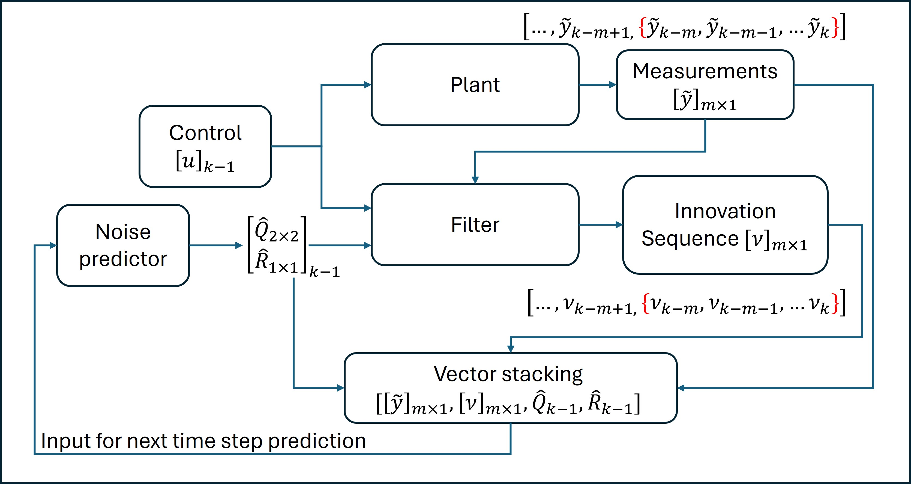
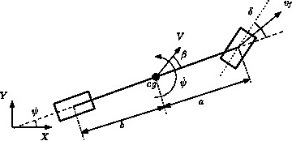
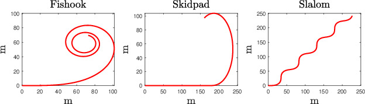
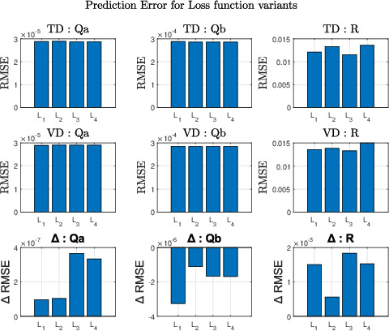
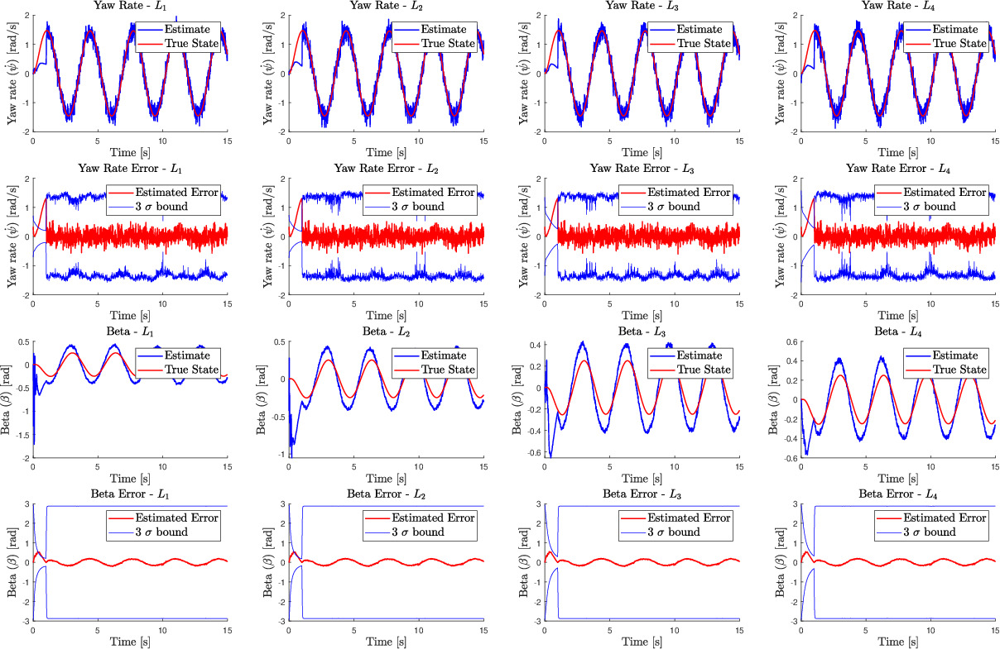
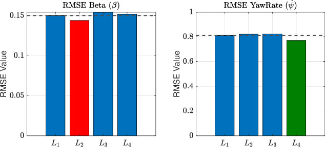

# Physics-constrained learning of stochastic characteristics

**Authors:** Pardha Sai Krishna Ala, Ameya Salvi, Venkat Krovi, and Matthias Schmid  
**Affiliation:** Department of Automotive Engineering, Clemson University

Learning process and measurement noise covariances for adaptive Kalman filtering and vehicle state estimation.

> **Paper implementation:** Start in [`MachineLearning/`](MachineLearning/), particularly [`MachineLearning/VehicleModel/`](MachineLearning/VehicleModel/). The `Batch_Run*`, `Sequential_Run*`, and root `train/` directories contain separate reinforcement learning experiments and are outside the scope of this paper.

## Research overview

Kalman filtering depends on the process noise covariance **Q** and measurement noise covariance **R**. In practice, their values are often uncertain, and poor choices can reduce estimation accuracy or cause filter divergence.

This work investigates a learned noise predictor within a recursive state estimation framework. Measurement and innovation histories, together with previous covariance estimates, are used to predict noise variances. Four training objectives compare covariance label prediction alone against models that include additional innovation autocorrelation and normalized innovation squared (NIS) terms.



## Vehicle state estimation

The study estimates vehicle sideslip angle **β** and yaw rate **r** using a nominal two-degree-of-freedom bicycle model. Steering angle is the control input, and yaw rate is the measured output. Plant-model mismatch includes changes in cornering stiffness associated with lateral load transfer.

<p align="center">
  
</p>

The predictor estimates three variances:
$$
Q_k =
\begin{bmatrix}
Q_{a,k} & 0 \\
0 & Q_{b,k}
\end{bmatrix},
\qquad R_k = [R_k].
$$

Here, **Qₐ** and **Qᵦ** correspond to the sideslip and yaw-rate process noise, respectively. The paper uses histories of 100 measurements and innovations, plus previous covariance estimates.

## Training objectives

The paper uses an ℓ₁ covariance label error, augmented with innovation statistics:

| Variant | Objective |
| --- | --- |
| L1 | Covariance label prediction error |
| L2 | Label error + innovation autocorrelation term |
| L3 | Label error + time-averaged NIS term |
| L4 | Label error + autocorrelation and NIS terms |

The paper sets the label weight to **1.0** and each statistical term's weight to **0.1**. Autocorrelation assesses temporal dependence in innovations; NIS relates the magnitude of innovations to the predicted covariance of innovations. These statistics complement the state estimation error when assessing filter behavior.

### Configuration reported in the paper

| Parameter | Value |
| --- | --- |
| Training samples | 50,000 |
| Maneuvers | Fishhook, skidpad, and slalom |
| History length | 100 samples |
| Noise variance upper bound | 10⁻³ |
| Network | LSTM followed by a fully connected layer |
| Activation | ReLU |
| Optimizer | Adam |
| Learning rate | 10⁻⁴ |
| Batch size | 128 |
| Epochs | 25 |
| Training hardware | NVIDIA A2000 GPU |



## Code navigation

The available implementation is **Python/PyTorch**. Begin with the vehicle-specific scripts below.

| File or directory | Purpose |
| --- | --- |
| [`MachineLearning/VehicleModel/VDdata_gen_dataset.py`](MachineLearning/VehicleModel/VDdata_gen_dataset.py) | Generates vehicle training samples and covariance labels |
| [`MachineLearning/VehicleModel/train_PINN.py`](MachineLearning/VehicleModel/train_PINN.py) | Trains the three-output predictor with configurable loss weights |
| [`MachineLearning/VehicleModel/VDkalman_filter_control.py`](MachineLearning/VehicleModel/VDkalman_filter_control.py) | Kalman filtering with vehicle model and control input |
| [`MachineLearning/VehicleModel/VDsample_autocorrelation.py`](MachineLearning/VehicleModel/VDsample_autocorrelation.py) | Autocorrelation statistic |
| [`MachineLearning/VehicleModel/VDnis_.py`](MachineLearning/VehicleModel/VDnis_.py) | NIS-related statistic |
| [`MachineLearning/VehicleModel/stateEstimationValidation.py`](MachineLearning/VehicleModel/stateEstimationValidation.py) | Evaluates a predictor in recursive vehicle state estimation |
| [`MachineLearning/VehicleModel/VDBIcyclemodel_BMW.py`](MachineLearning/VehicleModel/VDBIcyclemodel_BMW.py) | Bicycle vehicle model |
| [`MachineLearning/VehicleModel/VDFourwheelmodel_Plots.py`](MachineLearning/VehicleModel/VDFourwheelmodel_Plots.py) | Four-wheel vehicle simulation |
| [`MachineLearning/VehicleModel/VDlabelQR.py`](MachineLearning/VehicleModel/VDlabelQR.py) | Supporting covariance label generation |
| [`Images/`](Images/) | Framework, vehicle model, and paper result figures |

The parent `MachineLearning/` directory also contains two-output predictors, saved checkpoints, datasets, and validation scripts. These use different input/output dimensions from the vehicle-specific three-output predictor; use a checkpoint with its matching network definition.

## Setup and execution

Dependencies visible in the vehicle code include PyTorch, NumPy, pandas, SciPy, Matplotlib, and tqdm. The scripts call `.cuda()` directly and therefore expect a CUDA-capable GPU and a compatible PyTorch installation. CPU execution requires replacing those calls with device-aware code.

```bash
git clone https://github.com/pardhuAj/Adaptive_Estimation.git
cd Adaptive_Estimation
python -m venv .venv
source .venv/bin/activate
# Install PyTorch for your CUDA environment, then:
python -m pip install numpy pandas scipy matplotlib tqdm
cd MachineLearning/VehicleModel
```

Before running, update the absolute paths to the module, output, and checkpoint in the scripts to match your checkout. Dataset generation defaults to `vehicle_dataset.pkl`, while `train_PINN.py` currently hardcodes `vehicle_dataset_Bicycle.pkl` in its final training call. Align that call with the dataset you intend to use; the parsed `--dataset` argument is not currently passed to that call.

After these adjustments, generate a dataset:

```bash
python VDdata_gen_dataset.py
```

The following commands select the four loss-weight configurations and request 25 epochs. They illustrate the available training interface; they do not by themselves reproduce the paper's network or learning rate.

```bash
python train_PINN.py --var L1 --W1 1.0 --W2 0.0 --W3 0.0 --epochs 25
python train_PINN.py --var L2 --W1 1.0 --W2 0.1 --W3 0.0 --epochs 25
python train_PINN.py --var L3 --W1 1.0 --W2 0.0 --W3 0.1 --epochs 25
python train_PINN.py --var L4 --W1 1.0 --W2 0.1 --W3 0.1 --epochs 25
```

For state estimation evaluation, set `model_path` in `stateEstimationValidation.py` to the desired compatible checkpoint, then run:

```bash
python stateEstimationValidation.py
```

### Current implementation and reproducibility notes

The paper and the checked-in vehicle training script differ in several important ways:

- The paper describes an LSTM; `train_PINN.py` defines a fully connected network with two hidden layers of 128 units and three outputs.
- The paper specifies ℓ₁ label error and a learning rate of 10⁻⁴; the script uses `nn.MSELoss()` and defaults to 10⁻³.
- The script detaches predicted covariances before computing the NumPy-based autocorrelation and NIS terms, then converts those statistics into new tensors. Those terms contribute to the reported loss but do **not** propagate gradients back to the predictor in this implementation. Differentiable filter/statistic computations are needed for them to guide learning.

These differences should be resolved before treating a new training run as an exact reproduction of the paper. The execution instructions above are based on source inspection; training and simulation have not been validated in a fresh environment.

## Results reported in the paper

The paper evaluates covariance prediction and recursive vehicle state estimation, including state RMSE over **25 random validation runs**.

- **L2** gives the best overall covariance label prediction performance in the reported comparison and the best sideslip estimation RMSE among the four variants.
- **L4** gives the best yaw-rate estimation RMSE in the reported comparison.
- Yaw-rate estimation errors remain within the plotted **3σ** bounds for most samples, with an initial interval needed to fill the predictor's history buffers.
- Sideslip estimation is less accurate than yaw-rate estimation. The paper attributes this, in part, to the use of only yaw-rate measurements and the difficulty of inferring the sideslip process noise.

The findings indicate potential benefits from statistical constraints, while the influence of each constraint and the extent of generalization improvements require further investigation.







## Future work

Further study includes loss-weight tuning, richer maneuver datasets, improvements to network and training configurations, benchmarking against other adaptive filtering methods, and validation on time-varying and nonlinear systems.

## Acknowledgment

This work was supported by Clemson University's Virtual Prototyping of Autonomy Enabled Ground Systems (VIPR-GS), a US Army Center of Excellence for modeling and simulation of ground vehicles, under Cooperative Agreement W56HZV-21-2-0001 with the US Army DEVCOM Ground Vehicle Systems Center (GVSC).

