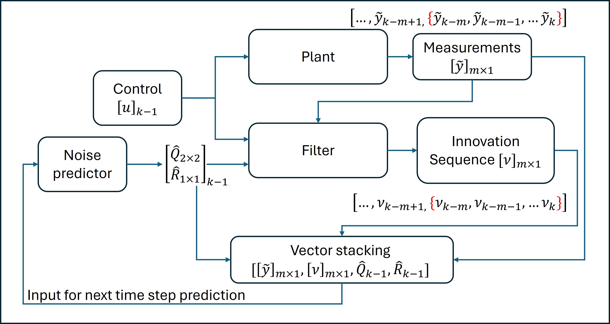

# Physics-constrained learning of stochastic characteristics

Accurate state estimation requires careful consideration of uncertainty surrounding the process and measurement models; these characteristics are usually not well-known and need an experienced designer to select the covariance matrices. An error in the selection of covariance matrices could impact the accuracy of the estimation algorithm and may sometimes cause the filter to diverge. Identifying noise characteristics has long been a challenging problem due to uncertainty surrounding noise sources and difficulties in systematic noise modeling. Most existing approaches try to identify unknown covariance matrices through an optimization algorithm involving innovation sequences. In recent years, learning approaches have been utilized to determine the stochastic characteristics of process and measurement models. We present a learning-based methodology with different loss functions to identify noise characteristics and test these approaches' performance for real-time vehicle state estimation.

## Overview
The vehicle motion can be described by different models depending on the level of fidelity required. A 2-DoF motion model describing lateral dynamics through the states, vehicle slip angle and yaw rate [**β**, $\dot{\psi}$]. A linear tire model, [F = C * α], with the cornering stiffness per axle, is used to model terrain-tire interaction and describe the dynamics of vehicle motion (\ref{eq:contdyn}). The discretized version of the bicycle model with nominal cornering stiffness is used for propagation and update of estimated states based on the measurement data.

